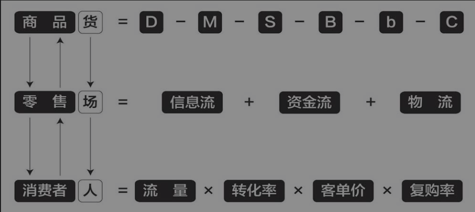
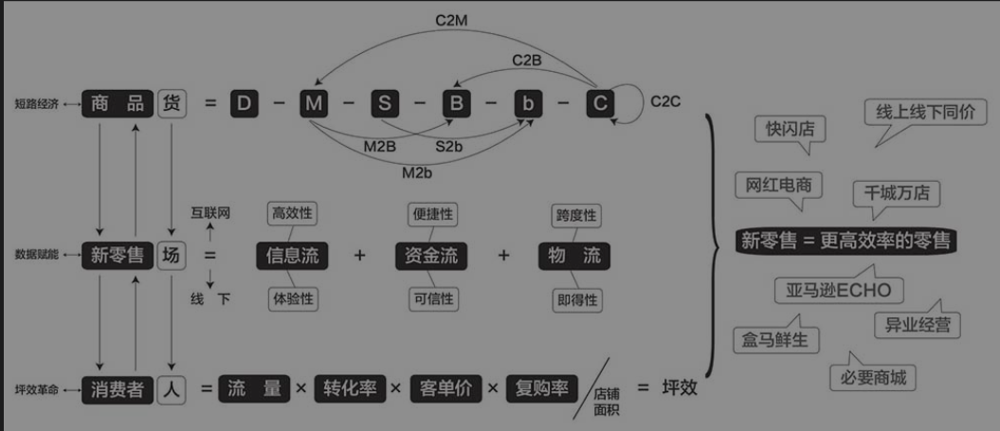

# 新零售：低价高效的数据赋能之路 #
 刘润

## 一、探索零售的本质 ##
◆ 零售是什么？零售，是一系列商业模式的统称，是通过某种“交易结构”，让消费者和商品之间产生连接，把商品卖给消费者；反之亦然，让消费者找到商品。用阿里巴巴的话语体系来讲，**零售其实就是把最终付钱的“人”（消费者）和“货”（商品）连接在一起的“场”**。这个“场”，可能是场景，可能是物理位置，也可能是一个呼叫中心，还可能是你去拜访陌生客户的行为。

◆ 零售的历史，非常悠久。在“物物交换”时代，有人家里养羊，有人家里种水稻，有人想吃大米，有人想吃羊肉，于是产生了交换。怎么交换？把羊牵到对方家去吗？他可能除了换米，还想换棉花、换青菜，这样一来就会非常麻烦。于是，这些有易物需求的人约定具体的交易时间和地点，后来交易的地点慢慢固定化，成为集市。集市——商业地产的雏形，其作用就是连接商品和需要商品的人，即连接“人”与“货”，我们称之为“场”。
市本来是一个约定，但后来越来越固定，逐渐演变为今天的“商业地产”。商业地产的发展，带来了百货商场。百货商场也是一个把“人”与“货”连接在一起的“场”。

后来，出现了连锁商店、超级市场，你去买酸奶、薯片，都是去一个把“人”与“货”连接在一起的“场”。再后来，出现了电商。电商也一样，淘宝、天猫、小米商城、京东、有赞商城、直播电商、朋友圈代购、微商等，都是一个个“场”，卖家拿着“货”去连接“人”，或是买家网聚“人”，一起去找“货”。

**零售的本质，是把“人”（消费者）和“货”（商品）连接在一起的“场”。不管技术与商业模式历经多少次变革，零售的基本要素，都离不开“人”“货”“场”这三个字。“人”“货”“场”是零售业永恒的概念。**


### 人：流量×转化率×客单价×复购率 ### 

◆ 购物中心之所以收商家的租金，是因为购物中心为商家带来了人流量，人流量才是真正的核心和价值。租金的本质，就是购物中心把人流量折算成一个价格，卖给商家。站在商家的角度来说，租金的本质，就是它付出的流量成本。怎么计算流量成本呢？假设一家商铺的租金为每月20万元，一个月有2 000人进店。那么，简单计算一下，你就知道，这家商铺为每一个进店的人支付了多少钱（20万元/2 000人=100元/人）。也就是说，这个商铺的流量成本是100元/人。

◆ 今天，不管是万达还是阿里巴巴，无论怎么打赌，谁赢谁输，其本质都是“吸引流量，再出售流量”的商业模式。如果把万达叫作商业地产，那么阿里巴巴就是“网络商业地产”；如果把阿里巴巴叫作“流量经济”，那么万达就是“线下的流量经济”，其商业本质没有任何区别。

### 货：D—M—S—B—b—C ###
◆ D=Design（设计），指产品款式的设计过程；
    M=Manufacture（制造商），也有人称其为工厂；
    S=Supply Chain（供应链），通常指的是总代理、省代理、分销商、经销商等机构；
    B=Business（大B，商场），指的是大卖场、超市、连锁店等；
    b=business（小b，商店），指的是夫妻店、地摊、微商等个人销售者；
    C=Consumer（消费者），也就是最终端的客户。

以皮鞋为例，设计师（D）研究市场、研究人体、研究时尚，设计出一双皮鞋，然后把设计卖给制造商；制造商（M）开模具，购买原材料、设备，雇人把鞋子做出来；皮鞋通过总代理、省级代理、市级代理等供应链企业（S），通过物流完成在全国的铺货，建立存库；皮鞋陈列在大商场（B），或是微商的朋友圈（b），抵达消费者；最终，消费者（C）下单购买。

### 场：信息流+资金流+物流 ###

◆ 去商场买一件蓝色衬衫，你获得了什么？获得了“信息流”。衣服的颜色、质地、款式，价格高低以及是否合身，都是信息，影响你是否购买的信息。因此，信息流是商家提供给消费者，帮助他决策的一个资源。

◆ 顾客想买某件商品，先摸一摸，然后看看是否过期、热量有没有超标等，这是“信息流”；觉得不错，把它放入购物车，推到收银台付钱，这是“资金流”；然后，自己开车或者坐超市的班车回家，这是“物流”。


**◆ 零售的本质到底是什么？不论是百货商场还是超市，不论是线下还是互联网，不论是万达广场还是淘宝、天猫，都不代表零售的本质。零售的本质，是连接“人”与“货”的“场”；而“场”的本质，是信息流、资金流和物流的万千组合。**



### 新零售 ###
**◆ 优化商品在人、货、场之间的有效传递方式，就是新零售。**

### 为什么会出现新零售 ### 

◆ “百货商场、连锁商店和超级市场”，前三次零售业革命带来的模式创新，在互联网面前节节败退，本来门庭若市的线下零售店门可罗雀。

◆ 用户数量增速放缓，电商数量却在迅猛增长。卖家比买家增长快，直接导致一个结果：互联网电商获得一个潜在客户的成本，即所谓的“流量成本”越来越高，在网上做生意越来越难，互联网的流量红利迅速消失。

####  怎样才能利用新技术，提升这个时代的零售效率呢？用数据赋能，提升“场”的效率；用坪效革命，提升“人”的效率；用短路经济，提升“货”的效率。 ####

## 二、数据赋能：线上、线下都不能代表新零售
### 零售，从来没有“本质”的交易结构 ###

◆ 传统超市的交易结构是：“用商品差价，补贴信息流成本”

◆ 信息流、资金流、物流的水，流向“线下获得信息流、线上付出资金流”，但不会停在这种互相为敌、你赢我就输的中间状态，还会不停演化，继续融合，直到所有人都获益，同时更高效、更稳定的新交易结构出现。这种“所有人都获益，同时更高效、更稳定的新交易结构”，就是“新零售”。

◆ 解决这个问题的办法，是交易结构的进一步优化：用品牌商体验店，取代代理商加盟店。


未来，线下会有越来越多的“品牌体验店”。所谓品牌体验店，是指我开店的第一目的，就是为了让你看、让你摸、让你闻、让你喜欢上我的产品，而不是销售。不以销售为第一目的，经销商就赚不到足够的差价，他们不会接受。没关系，那品牌商就自己开，自己支付租金成本。  
为什么？因为无论线下还是线上购买，收入都是品牌商的。甚至，对财务来说，体验店的租金、库存等信息流成本，未来会被计入品牌及营销成本内，而非销售成本。那如果品牌商开不了这么多体验店，怎么办？未来可能会有大批代理商转型为服务商，专门提供帮助品牌商开体验店的服务。品牌商考核它们的，不再是销售额，而是用户满意度。进一步说，代理销售店向品牌体验店的转型，可能会进一步带动百货商场 *收取扣点的联营模式，向购物中心的租金模式转型。*


## 信息流：高效性vs体验性 ## 

新零售的方向，必然是结合互联网信息流的“高效性”和线下信息流的“体验性”。

```
小米之家：
在小米之家，不仅陈列了小米手机，还有小米笔记本、空气净化器、净水器、电饭煲等智能家居产品，以及小米手环、移动电源等手机周边配件。这些商品来自小米的生态链企业。以前，很多人都不知道小米竟然有这么丰富的产品。现在，这些产品都放在你面前，你可以用手去摸一摸产品的质感，这就是“不卖货的体验店”。但是，小米的另一个决定，让这个不卖货的体验店卖货效率出奇的高。那就是“线上、线下同价”。
线上数据还能有效地降低库存。目前，小米之家主要依赖于小米商城对于产品销量的预计来订货，20%依赖于生态链企业配合小米之家的判断进行提前备货。当生态链企业发现某个产品好卖，即便小米商城还没有向生态链订货，生态链自己也会做一部分备货，以防万一出现脱销的情况来不及生产。
```
```
亚马逊的实体书店：
Amazon Books的经营者将基于亚马逊官网上的消费者评价、预购量、销售量、受欢迎程度做出评价，最终选择那些更有可能引起消费者兴趣的书籍。
在书籍的陈列上，Amazon Books也一反常态，打破按照政治、经济、社会、文学等大类进行分类摆放的做法。当你逛Amazon Books实体店时，看到的是“读者最喜欢的食谱”“评分在4.5分以上的图书”“96%的读者给了5分满分的图书”“如果你喜欢这本书，后面的这一排书你也可能会喜欢”等类目。
Amazon Books中书籍下方的信息展示除了价格等基本信息之外，还加入了更多有意思的内容，譬如读者给该书的总体评价，并精选一些读者的反馈。这些信息不仅对购书者十分关键，还丰富了消费者体验，强化了线下和线上的关系，形成相互联结的态势。
```
## 资金流：便携性vs可信性 ## 

◆ 双向同时，是传统零售资金流和物流的常态。你在商场买东西，基本上都是一手交钱，一手交货。然后，互联网出现了。网上购物，给我们带来信息流的高效性，展示信息的方式更快、更全、更便宜了。但是，资金流和物流这对亲兄弟，却被强行分开了。买家和卖家相隔甚远，无法做到一手交钱，一手交货，因此必须做个约定，到底是我先付钱，还是你先发货。这两件事情，没有办法同时进行。这就带来信任的问题。线下零售一定要意识到，见面带来的可信性，到今天为止都是线下零售的巨大优势。很多老人不敢在网上买东西，就是因为对网上支付的资金安全不信任。

由此可见，由于相对于线下缺乏可信性，线上资金流更容易发生在小额交易上；而大额交易，可能会带来可信性的心理障碍。所以，面对互联网，线下零售要明白自己可信性强这个独特性，在大金额交易上寻找战略优势。

◆ 新零售：用数据建立新的信用：
京东白条，阿里巴巴的花呗、借呗、芝麻信用，腾讯的微粒贷等，用数据赋能互联网的资金流，让零售不再必须在便捷性和可信性之间做单选题。


## 物流：跨度性vs即得性 ## 

◆ 全世界的货物都可以奔向你，价格也会被拉平。这就是互联网电商物流的跨度性优势。

◆ 互联网的跨度性，带来了“全”；线下的即得性，带来了“快”。

◆ 要是互联网的跨度性和线下的即得性可以兼得就好了。怎么做呢？从商业的角度来说，有两个办法：  
1. 让线下商品离你更近，越近越有即得性。如果能更智慧地安排库存，把我想买的商品，放在离我最近的地方就好了。  
2. 让互联网的物流更快。互联网的跨度性，让你可以买到几乎任何产品，但终究有时差。如果能增加物流速度，用快来对冲距离就好了。

## 三、坪效革命：从“人”的角度理解新零售 ##
**销售漏斗公式：销售额=流量×转化率×客单价×复购率**

1. 流量：一切与消费者的触点  
 “旺铺思维”是坐在那里，等着消费者来； “流量思维”是用户在哪里，就跑到哪里去。  
2. 转化率：提高转化率，找对社群很重要  
3. 客单价：更透析数据，更洞察用户。提高客单价的传统方法，是“连带率”。  
4. 复购率：体现“忠诚度”

```
北京有家创业公司“零时尚”，在社区里开了不少女装店。这家公司做得不错，发展迅速，但也遇到了“流量天花板”，怎么办？寻找新流量，提高转化率，增加客单价。  
零时尚的目标流量，也就是社区里的女性消费者，她们到底分布在哪儿呢？除了服装店，她们还在美发店、便利店和美容院。那就和这些异业结成联盟，把它们的流量收集起来。于是，零时尚与美容院合作，创造了一种叫作“蝶衣Box”的商业模式。这就是“寻找新流量”。  
美容院的员工与顾客有充分的信任关系和大量的交流时间。经他们推荐，顾客在零时尚App上，完成详细的身体特征识别，就可以申请免费试穿一盒专门为她搭配的衣服。美容院的环境、员工与顾客之间的信任，增加了推荐的可能性。这就是“提高转化率”。  
几天后，顾客再去美容院时，一盒十几件衣服已经送到，里面还有这些衣服应该怎么搭配的介绍。顾客一件件试穿，照着镜子感受专业搭配带来的惊喜。专业就是专业，这么搭配好看，那么搭配也好看，于是，很多顾客会忍不住多买了几件。这就是“增加客单价”。
```
◆ 怎样才能让买过的用户一买再买，并介绍别人来买？这就是提高复购率需要研究的问题。因为用户只要每多买一次，第一次获客的成本就可以被多摊薄一次。提高复购率，挖掘客户终身价值，是新零售的终极大杀器。


### 小米新零售，如何做到20倍坪效 ###

◆ 极致的坪效只是结果，把流量、转化率、客单价、复购率做到极致，才是手段。雷军开始耐心地逐一解释他的战略和打法。

#### 选址对标快时尚+低频变高频 ####

◆ 他们发现小米的用户和优衣库、星巴克、无印良品的用户高度重合。把店开在地铁站，人流量虽然很大，但是大家不进店；把店开在重奢的商场，大家购买的心态和频次都很低。所以，小米确定了和优衣库、星巴克、无印良品对标开店的选址策略。
小米之家在入驻商圈之前，一定会统计客流，计算单位时间内的人流量。

◆ 什么是低频变高频？比如58同城这个网站，求职、租房，一年有一次就不错了，都是低频生意，但是把100个低频分类信息加在一起，就变成了高频。  
在小米之家，这次买了手机，过段时间买个手环，下次再换个蓝牙音响，这样一来，就把一年来买一次手机的低频，变成了每半个月来一次的高频；把进店没东西可买的低效流量，变成了进店总能买几样东西的高效流量，从而解决了流量问题。

#### 爆品战略+大数据选品 #### 
◆ 小米一直有个极致单品的逻辑，叫“爆品战略”。虽然看起来有很多产品，但是每一个品类小米都只有几款产品。比如箱子就两三款，雨伞只有一款。其他的公司，可能会做几百款。

◆ 爆品战略带来两个好处。首先，可以在单件产品上倾注更多的心血，因此设计感、品质都有机会做得更好。一件设计感更好的商品，本身就能带来更多转化率。我们称之为“静销力”，静静地放在那儿，你就忍不住要买。  
其次，爆品带来的巨大销量，又必然会带来供应链成本的降低，导致价格尽可能地便宜。一件品质很好又便宜的商品，当然能带来更巨大的转化率。

◆ 通过大数据精准选品，卖畅销品，卖当地最好卖的货，大大提高了用户的转化率。

### 提高连带率+增加体验感 ### 

◆ 之间技术上的关联性、协同性，甚至仅仅是外观上的一致性，都会提高连带率，让用户忍不住多买。

◆ 因为很多手机商店只卖低频消费手机，所以必须强行推销。但是小米通过“低频变高频”，无须推销，甚至规定店员不经允许不能去打扰客户。为什么？因为这样用户才能充分感受产品、感叹价格。

#### 强化品牌认知+打通全渠道 ### 
◆ 顾客在小米之家购买商品时，店员会引导他在手机上安装小米商城App，如果顾客喜欢小米的产品，下次购买就可以通过手机完成。第二次在小米商城的购买，可以在更全的品类中选择，并且没有线下的租金成本。

### 盒马鲜生，被线下门店武装的生鲜电商 ### 
张勇当即决定支持侯毅，但提出四点刚性要求：  
第一，如果线下生鲜店最终搞成了传统超市，那就算比传统超市挣钱，也不干。如果真要搞，线上的收入必须大于线下。  
第二，线上的每日订单一定要超过5 000单，这样才真正是一门有规模效应的生意。  
第三，在冷链物流做到低成本可控的前提下，实现门店3公里半径内30分钟完成配送。  
第四，最终要做到线下往线上引流，App不需要其他流量支持，能够独立生存。  
这四点要求其实就是“顶层设计”


#### 现买现吃，打造极致体验 #### 

#### 为什么必须用App才能买单 ####
◆ 回到坪效公式，总体收入翻倍，身为分母的面积不变，那么单店的坪效也就随之翻番，利润也随之增加。如果线上销售额能进一步增加，线上和线下的比例能做到2∶1，那么，同样的店租所产生的收入，将会是原来的三倍，这就是只能用盒马鲜生App付款的最终目的。

#### 30分钟物流打造“盒区房” #### 

◆ 盒马鲜生在30分钟这件事上下狠功夫，主要取决于以下两点：第一，盒马鲜生的最终目的是让用户在线上买东西，不去门店也会在线上下单。只有顾客在网上下单才能提高复购率，才有可能真正突破传统生鲜门店，实现真正的坪效革命。第二，基于这一目的，盒马鲜生的核心价值就是往线上导流。

◆ 坪效革命，来自完全不同的交易结构在超市里开餐厅、只能用App买单、在头顶上安装传送带实现30分钟送货，这三件事背后只有一个逻辑：通过重新定义实体店，把盒马鲜生设计为“被线下门店武装的生鲜电商”。

## 四、短路经济：环节越短，效率越高 ##
### 商品供应链：人与货不必在商场相见 ###

◆ 零售的英文是“retail”。中文和英文，正好侧重这个商业形态的两个特征：中文“零售”中的“零”，强调“少量”；英文“retail”中的“tail”（尾巴），强调“末端”，直接面对消费者。在一些地区，只有80%的商品是直接卖给消费者的B，才允许叫作“retailer”（零售商）。所以，零售就是把少量的商品卖给末端的消费者。零售这个词，是相对于wholesale（批发）而存在的。批发，就是把大量的商品卖给中间零售商。

◆ 为什么很多厂家（M）不愿意和消费者（C）打交道，直接用M2C模式把商品卖出去？就是因为消费者买得太少，而且太麻烦。所以，厂家选择省事的薄利多销，而零售商选择麻烦的高利少销，赚取其应得的批零差价。

◆ 定倍率就是商品的零售价除以成本价得到的倍数。100元成本的东西卖500元，那它的定倍率就是5。定倍率是商业世界最基础的逻辑之一，是衡量商业效率的重要指标。定倍率越低，效率越高。  
 这400元，是为促成这笔交易，必须支出的费用。如果说那100元是制造成本，这400元就是交易成本。站在消费者的角度来讲，交易成本就是如何找到商品的成本；站在企业的角度，则是商品怎么找到消费者，彼此发现的成本。

◆ 零售从业者不仅要有用户思维、产品思维，同时也要有交易结构思维，优化自己的商业模式。怎么优化？零售商不应该仅仅面对消费者，而应该转过身来，把眼光望向整条商品供应链，利用新科技，优化、缩短，甚至砍掉不再高效的环节。我把这种新零售的趋势，称为 #*“短路经济”*

◆ ◆ 短路经济有两种形态：环节短路和链条反向。  
环节短路比如梅西百货，缩短制造商（M）和零售商（B）之间的供应链（S），形成M2B的短路经济模式；  
链条反向。比如团购网站，把从零售商（B）到消费者（C）的商品供应链，反转为从消费者到零售商，形成C2B的短路经济模式。

### Costco：M2B成就零售“优等生” ### 
1. 会员制引领Costco
2. 低价格+高口碑，会员费反哺利润
```
会员制给Costco带来的好处很多。首先，缩小了目标客户范围。Costco将目标客户锁定在中产阶级家庭，“是否愿意支出会员费”成为区分受众购买力最简单的标准。在会员费门槛之上，Costco圈定较为精准的客户群体，相应地，对会员的数据监测更简单，也更容易提高服务水平和运营效率。  其次，会员制也便于提升用户的忠诚度。在同等价格和质量水平下，消费者往往会因前期的会员费成本而优先考虑在Costco消费，这样才能让自己的会员资格物有所值。在不断的良性循环中，消费者更加认可已选择的品牌，并保持着较高的黏性。Costco会员的续订率达90%，每年都为Costco贡献一笔稳定的收入。

主要利润来自会员费的商业模式，给了Costco必须进行短路经济，大刀阔斧砍掉中间环节，极大降低商品价格的原动力。  
商品的售价，主要取决于两个因素：一是进货的价格，二是零售商的毛利。在强大的会员体系支撑下，Costco在这两方面都尽可能地做到最低。  
进货价格方面，Costco采用超低SKU策略。沃尔玛的SKU大约在10万个，每个商品品类向消费者提供非常多样的选择，而Costco仅仅提供约4 000个活跃SKU。Costco会选择它认为有“爆款”潜质的商品上架，每个品类虽然选择不多，但都是Costco精挑细选的优质商品，且包装很大，量很足。  
这样，更少的SKU节省了预定、追踪和展示的成本，降低了平均库存成本。Costco库存周期只有29.5天，低于沃尔玛的42天和塔吉特的58天。库存周期的压缩，带来了资金运转效率的提升，经营成本也有一定程度的下降。  
另一方面，单品类的SKU往往代表足够大的订单量和更少的品牌竞争，Costco从而获得与生产商之间更强的议价能力，进货价非常便宜。在毛利率方面，Costco内部规定，所有商品的毛利率不超过14%.  
同时，Costco的自有品牌非常著名。品牌代表稳定的预期，稳定的预期必然包含相应的溢价。Costco连这部分溢价都不愿意让会员多付。
Costco通过会员模式、低SKU，获得极强的议价能力，通过自有品牌减少中间经销商环节，用巨大的溢价能力，直接从制造商（M）采购，最有效率地陈列在自己的卖场（B）里，短路了中间的供应链（S），极大提升了整个链条的效率。Costco作为大B，成为短路经济的一个代表，我们可以把这种模式叫作M2B。
```
> 雷军《小米创业思考》也有对开市客的介绍
### 名创优品：M2b让实体小店拥抱春天  ### 
1. 黄金地段的小生意
2. 别人投资，自己管理
3. 聚沙成塔的规模效应
```
名创优品旗下的店铺，都是100~200平方米左右的小店（b）,店铺虽小，但选址都很好，其门店几乎都开在购物中心和主流步行街。    
名创优品在全国也没有一家加盟店，直接从工厂到店铺，中间没有任何环节。直管，就是别人投资，自己管理。
叶国富通过直管的模式，迅速聚集了1 000多家小b。然后，他用这1 000多家小b的议价能力，直接找到了制造商（M），进行大规模采购，而且是一次性付款。制造商当然很高兴。但是，名创优品希望制造商在同品质的情况下，将常规出厂价降低一半。制造商想了想，还是答应了。因为他们最在乎的不是毛利率，而是利润绝对值。
```
### 闲鱼、瓜子二手车：C2C打开万亿二手市场   ### 
 信用这项虚拟资产，在这个虚拟的时空中，其价值被充分地放大了

### 天猫小店：S2b赋能传统夫妻店 ### 

在天猫小店的案例中，S是天猫搭建的零售通平台，小b是散落在全国各地无数小区里的传统小卖部。因为S的存在，小b再也不用去批发市场进货了，S2b短路了中间的层层渠道。


### 海尔、必要、红领：链条反向模式走高质低价路线 ### 

◆ 如果把商品供应链反过来呢？零售不再是链条的末端，而变成开头呢？如果能拿着有名有姓的真实需求，反向往上求，按需生产，不就没有库存了吗？于是C2B模式、C2M模式，应运而生。  
```
C2B：海尔的无灯工厂  
2013年，海尔和天猫合作，在双十一推出了C2B定制冰箱。消费者（C）可以在海尔天猫旗舰店上按需选择容积大小、调温方式、门体材质、外观图案等。海尔柔性化的生产链，可以同时满足超过500个型号的产品定制服务。  
消费者选择并定制后，在天猫旗舰店（B）下单，然后海尔的工厂开始按照消费者的定制要求，按单生产。
```  

```
◆ 反向定制的本质，是反向，不是定制。  
C2M：必要商城
必要商城是一个被称C2M的反向定制平台，消费者先按照自己的尺码和喜好下单，然后厂家再生产。在毕胜看来，C2M是解决库存难题的终极答案。C2M模式是按需生产，没有库销比，先有订单再生产，最大限度地解决库存问题。
```
◆ 海尔是从制造商进入零售，必要商城是从零售商倒逼商品供应链。这两家公司的基本逻辑完全一样，用链条反转的短路经济模式，消灭库存，提升商业效率。


## 五、未来已来 ##

1. 零售的本质，是连接“人”与“货”的“场”；
2. “场”，是信息流、资金流和物流的万千组合；
3. “人”，会通过“流量x转化率x客单价x复购率”的层层过滤，接触“货”；
4. “货”，要经历D—M—S—B—b—C的千山万水，抵达“人”。

怎样才能提高零售的效率呢？
1. 用“数据赋能”，优化信息流、资金流、物流的组合；  
2. 用“坪效革命”，提升流量、转化率、客单价、复购率的效率；  
3. 用“短路经济”，缩短D—M—S—B—b—C的路径。




## 六、变革时代的思维模式

◆ 商业模式，就是利益相关者的交易结构。


◆ 亚马逊是美国最大的电商平台，有人说，亚马逊是美国的阿里巴巴，其实两者的赚钱方式、商业模式完全不同。

最大的不同体现在，你可以用谷歌等外部链接搜索到亚马逊的商品。亚马逊根本不在乎客户是不是在自己的平台上搜索到商品。亚马逊赚钱的方式不靠广告，而是靠卖家的分成。比如卖家卖一件商品，亚马逊收2%的提成。不管是通过内部搜索还是外部链接找到商品，只要完成交易，亚马逊就能从中赚到钱。  
阿里巴巴收取的是广告费，而亚马逊收取的是交易费。虽然商业模式不同，但亚马逊也是一个完全站在用户立场的企业。它提供平台让用户搜索商品，同时会对商家进行严格的筛选和评估。亚马逊不对卖家进行竞价排名，一旦有用户投诉商品有问题，被投诉的商品会立即下架，不管是多大的品牌。